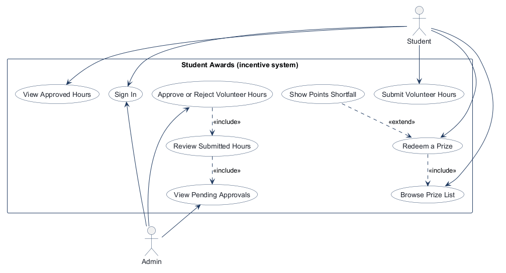
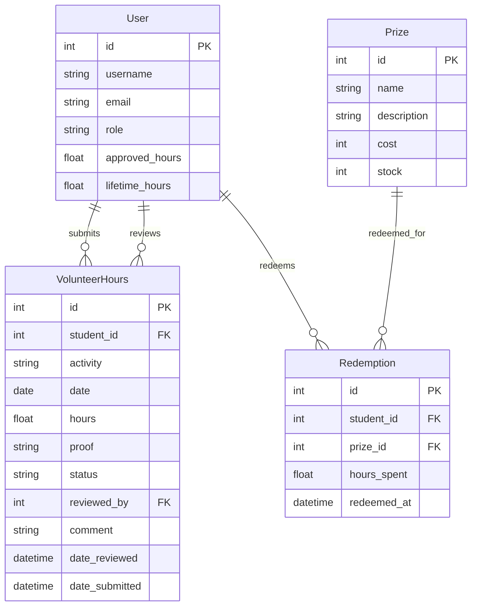
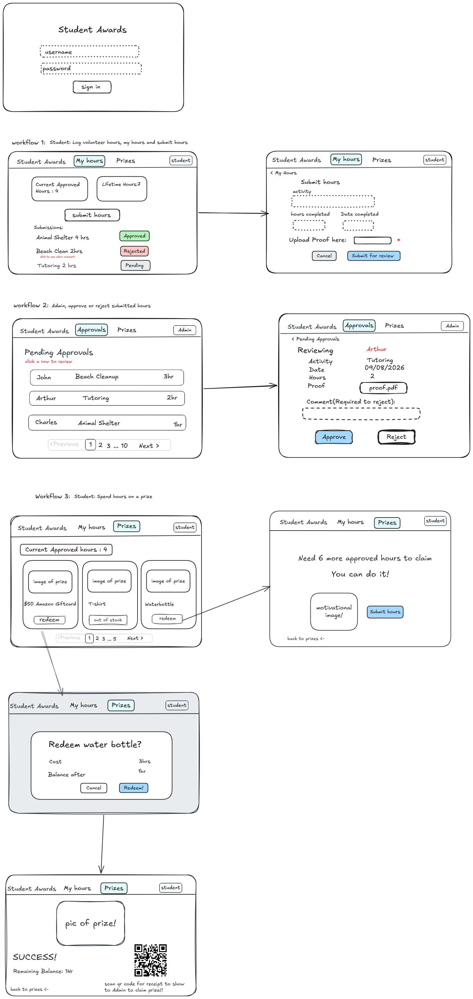

# COMP 3613 Assignment 1

Draft this file with the Guide. **Update it after every phase milestone** before you pause. The use-case diagram is a UML PNG at `docs/diagrams/use-case.png`, linked from this file as `diagrams/use-case.png` (path relative to `docs/report.md`). The model diagram is Mermaid. **Embed wireframe images** as `wireframes/<file>` (files live in `docs/wireframes/`).

Do not put your student ID in this file if you will commit it. The PDF cover adds your name and ID at export time.

## Assigned project
Student Awards (incentive system)

## Three workflows

### 1.
Submit Volunteer Hours (Student)

### 2.
Approve or Reject Volunteer Hours (Admin)

### 3.
Redeem a Prize (Student)

## Use case diagram

Student and Admin both sign in; the workflows are role-specific. Approving or rejecting hours includes reviewing the submission and pending-approval list. Redeeming a prize includes browsing the list, which shows required approved points and stock. If the student has too few approved points, a conditional extension reports the shortfall. The approved-hours and pending-approvals views are separate use cases.

## Model diagram

First draft. Update this section in Phase 5 when polish revises the model, and note what changed.

Assumption: `reviewed_by` points to another `User` record, typically an admin, and prize redemption is a separate record linked to the student and prize.

## Wireframes

### Student Awards workflow board

Model revision notes from the wireframe:
- `User.current_hrs` → `User.approved_hours` — seen on the student and prize screens, where the value is described as "Current approved hours" and used to gate prize redemption.
- `User.lifetime_hours` — shown separately from the current approved balance; the student chose to count approved hours only. It increases on approval and is not reduced by redemptions.
- `VolunteerHours.status` — seen on the student hours list where rows are labeled "Approved", "Rejected", and "Pending"; keep a constrained status field in the model rather than a free-form string.
- `VolunteerHours.proof` — seen on the submit form where the student uploads proof and is tied to each volunteer-hours record.
- `Prize.stock` — seen on the prize list where each prize displays stock and availability.
- `Redemption.redeemed_at` — seen on the redeemed success card and consistent with a separate prize redemption record.
- Phase 5 student revisions: `User.approved_hours`, `VolunteerHours.hours`, and `Redemption.hours_spent` use float types; `VolunteerHours.status` is a constrained Pending/Approved/Rejected enum.

<!-- student-build:wireframe-coverage
use_case: Submit Volunteer Hours (Student)
image: docs/wireframes/wireframes.png
covered: yes
-->

<!-- student-build:wireframe-coverage
use_case: Approve or Reject Volunteer Hours (Admin)
image: docs/wireframes/wireframes.png
covered: yes
-->

<!-- student-build:wireframe-coverage
use_case: Redeem a Prize (Student)
image: docs/wireframes/wireframes.png
covered: yes
-->

<!-- student-build:wireframe-coverage
use_case: Sign In
image: docs/wireframes/wireframes.png
covered: yes
-->

`python manage.py report` also embeds any PNG/JPG still missing from `docs/wireframes/`.

## Theming

- Colors: gold and navy blue, with light neutral backgrounds for readability.
- Type: gamified and playful.
- Tone: playful and encouraging.
- Logo / wordmark: Student Awards with a small star icon.
- Applied across landing, login, registration, and the authenticated shell using shared CSS tokens, Fredoka display type, Nunito body type, star branding, and encouraging copy.

## Implementation notes

One named workflow at a time. Include verify notes and polish / model revisions (Phase 5). Do not treat the first build as final.

Phase 5 theming is applied to the landing, login, registration, and authenticated shell. Submit Volunteer Hours now has a My Hours dashboard, pending-status history, approved and lifetime totals, a separate submission form, local proof-file storage, and a thin service-calling route. The student chose to return to My Hours after submit, and to count approved hours only in Lifetime Hours. Student verified locally after initializing and running the app: a newly registered account submitted 2 hours with PNG proof, returned to My Hours, saw the entry as Pending, retained an approved balance of 0, and found the file in `uploads/`.

<!-- student-build:code-check
workflow: Submit Volunteer Hours (Student)
form: choice
layer: other
architecture_ok: yes
implement_confidence: 0.75
passed: yes
note: Chose to return to My Hours with the new item marked Pending, matching the wireframe lifecycle.
-->

<!-- student-build:code-check
workflow: Submit Volunteer Hours (Student)
form: snippet
layer: model
architecture_ok: yes
implement_confidence: 0.60
passed: partial
note: Added the approved-hours balance and submission model; several property names diverged from the ERD and needed alignment.
-->

<!-- student-build:code-check
workflow: Submit Volunteer Hours (Student)
form: choice
layer: model
architecture_ok: yes
implement_confidence: 0.60
passed: yes
note: Chose to retain the agreed ERD field names and revise the model snippet to match.
-->

<!-- student-build:code-check
workflow: Submit Volunteer Hours (Student)
form: choice
layer: model
architecture_ok: yes
implement_confidence: 0.60
passed: yes
note: Revised the ERD hours property from decimal to float at the student's request.
-->

<!-- student-build:code-check
workflow: Submit Volunteer Hours (Student)
form: choice
layer: model
architecture_ok: yes
implement_confidence: 0.60
passed: yes
note: Student requested float types for User.approved_hours and Redemption.hours_spent; both were updated in the ERD.
-->

<!-- student-build:code-check
workflow: Submit Volunteer Hours (Student)
form: snippet
layer: model
architecture_ok: yes
implement_confidence: 0.50
passed: partial
note: Second model attempt retained ERD mismatches for reviewer/comment fields and included unresolved Enum/date typing issues; a corrected pass is required.
-->

<!-- student-build:code-check
workflow: Submit Volunteer Hours (Student)
form: snippet
layer: model
architecture_ok: yes
implement_confidence: 0.60
passed: yes
note: Corrected VolunteerHours fields/types to match the revised ERD, including the constrained status enum.
-->

<!-- student-build:code-check
workflow: Submit Volunteer Hours (Student)
form: snippet
layer: repository
architecture_ok: yes
implement_confidence: 0.60
passed: yes
note: Repository adds, commits, refreshes, and returns the VolunteerHours record; no business rules in the repository.
-->

<!-- student-build:code-check
workflow: Submit Volunteer Hours (Student)
form: choice
layer: service
architecture_ok: yes
implement_confidence: 0.60
passed: yes
note: Chose local upload storage with its path recorded in VolunteerHours.proof.
-->

<!-- student-build:code-check
workflow: Submit Volunteer Hours (Student)
form: snippet
layer: service
architecture_ok: yes
implement_confidence: 0.60
passed: yes
note: Service validates inputs, writes proof locally, creates Pending record, and delegates persistence.
-->

<!-- student-build:code-check
workflow: Submit Volunteer Hours (Student)
form: snippet
layer: router
architecture_ok: yes
implement_confidence: 0.40
passed: partial
note: Thin service-calling route attempt used the wrong repository constructor keyword, omitted the success redirect, and passed an optional user id without a guard.
-->

<!-- student-build:code-check
workflow: Submit Volunteer Hours (Student)
form: snippet
layer: router
architecture_ok: yes
implement_confidence: 0.60
passed: yes
note: Corrected route guards user.id, calls the service without persistence logic, explicitly handles expected errors, and redirects on success.
-->

<!-- student-build:code-check
workflow: Submit Volunteer Hours (Student)
form: open
layer: other
architecture_ok: yes
implement_confidence: 0.60
passed: yes
note: Student confirmed end-to-end local submission, Pending display, unchanged approved balance, and local PNG proof storage.
-->

<!-- student-build:code-check
workflow: Approve or Reject Volunteer Hours (Admin)
form: choice
layer: service
architecture_ok: yes
implement_confidence: 0.60
passed: yes
note: Chose to increment approved_hours and lifetime_hours when an admin approval is saved.
-->

<!-- student-build:code-check
workflow: Approve or Reject Volunteer Hours (Admin)
form: snippet
layer: model
architecture_ok: yes
implement_confidence: 0.50
passed: partial
note: Added User-side submitted/reviewed relationships; VolunteerHours relationship declarations were outside the model class and need correction.
-->

<!-- student-build:code-check
workflow: Approve or Reject Volunteer Hours (Admin)
form: snippet
layer: model
architecture_ok: yes
implement_confidence: 0.50
passed: yes
note: Added paired SQLModel relationships for student submissions and admin reviews using their distinct foreign keys.
-->

<!-- student-build:code-check
workflow: Approve or Reject Volunteer Hours (Admin)
form: snippet
layer: repository
architecture_ok: yes
implement_confidence: 0.50
passed: yes
note: Pending list query uses the HoursStatus enum and oldest-first ordering; the submission workflow has made the student's enum choice concrete.
-->

<!-- student-build:code-check
workflow: Approve or Reject Volunteer Hours (Admin)
form: snippet
layer: service
architecture_ok: yes
implement_confidence: 0.40
passed: partial
note: Initial review service updates status and approved/lifetime totals, but omits the pending-only guard, required rejection comment, and reviewer foreign key assignment.
-->

<!-- student-build:code-check
workflow: Approve or Reject Volunteer Hours (Admin)
form: snippet
layer: service
architecture_ok: yes
implement_confidence: 0.40
passed: yes
note: Revised service enforces Pending-only review, requires rejection comment, records reviewer, and updates both approved/lifetime balances on approval.
-->

<!-- student-build:code-check
workflow: Submit Volunteer Hours (Student)
form: choice
layer: model
architecture_ok: yes
implement_confidence: 0.60
passed: yes
note: Chose approved hours only for the Lifetime Hours display; added a separate cumulative float field in the ERD and User model.
-->

## Deployed app

Phase 6. Public Render URL (not localhost). Markers open this to mark the three workflows.

https://

## Logins

Every account a marker needs, including extra users you added. Starter accounts:

- bob / bobpass — regular user
- admin / adminpass — admin

## YouTube URL

## Session transcripts

Filled when the Guide builds the report: the agent writes each Guide chat to `docs/transcripts/<slug>.md` (Copilot Agent, Cursor, or OpenCode). `python manage.py report` packages them. Do not paste chats here during the build.

## Competency (student-judge)

Filled when the report is built. Guide runs student-judge, writes `docs/judge.md`, and export appends the scorecard here.

## Skill integrity

Filled by `python manage.py report`. Do not edit the course skills.
